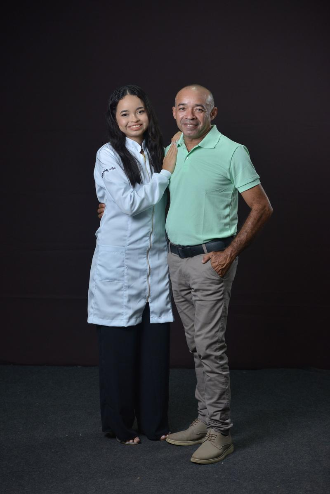

<!DOCTYPE html>
<html lang="pt-br">
<head>
  <meta charset="UTF-8">
  <title>Feliz Dia dos Pais</title>
  
</head>
<body>
  <h1>Feliz Dia dos Pais!</h1>
  
  

    Feliz Dia dos Pais!
Pai, esse é um pequeno gesto para lembrar o quanto você é importante na minha vida.  
     
Obrigado por cada conselho, por cada exemplo, por estar sempre ao meu lado.  
     
Esse relógio é só um presente… Mas o tempo que passamos juntos é o que eu mais valorizo.
 
Te amo! ❤️  
     
Com carinho,Débora ❤️❤️.
  

</body>
</html>
